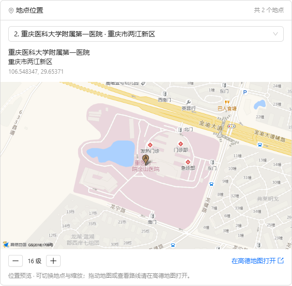

# MCP 服务接入与组合编排

## 入口与操作

AI中心下新增“MCP服务管理”和“MCP服务编排”。先连接服务读取真实工具定义，再把工具拖入画布，连线设置执行顺序；参数可填写固定值、引用流程输入或已连线前序节点的结果。

工具参数采用服务返回的 JSON Schema 校验。引用保留对象、数组、数字等原始类型，例如：

```json
{"query":{"$from":"input","path":"/query"}}
```

```json
{"query":{"$from":"n_lookup","path":"/documents/0/title"}}
```

路径采用 JSON Pointer，空路径引用整个对象。循环、断开的节点和引用未连线的前序节点会阻止保存或运行。节点失败、字段缺失时停止后续执行，保留已完成的结果。

“输入与结果”展示每个节点的真实执行结果。“发布API”保存当前版本快照，修改草稿不改变已发布版本；停用后 API 不再执行。API 使用当前平台身份认证，作用域与编辑者账号一致。

## 标准服务接入

- 支持 Streamable HTTP、SSE 与后台登记的 stdio 本地进程；工具目录分页读取。
- 支持无需认证、Bearer Token、自定义 API Key 请求头、URL 参数密钥和 stdio 环境变量密钥。
- 密钥使用服务端 SECRET_KEY 派生密钥加密保存，接口只返回 has_key。修改地址或认证方式必须重新填写密钥；SECRET_KEY 需要稳定保存。
- 外部服务只接收其配置的凭据，不转发平台 Token、平台会话或浏览器 Cookie。
- 内置平台服务继续沿用正常登录身份，可查询设备、时序、工况、知识、位置及业务数据。
- 新服务自动进入智能体的服务目录，同名外部工具在模型调用时使用不同别名，避免串用服务。
- 图像、音频等 MCP 返回内容保留在结果中，当前调试页按 JSON 展示。

stdio 仅运行后台 `MCP_STDIO_CONFIG_FILE` 登记的程序，不能从浏览器提交命令。平台密钥不会随父进程环境传给子进程。URL 参数密钥加密存储，并在底层传输时注入，配置和 HTTPX 请求日志保留不含密钥的地址。本版不实现第三方 OAuth；表单里的场景分类不代表相应推理引擎已经部署。

四类接入模板：DeepL（stdio / 环境变量密钥）、PaddleOCR（自建 Streamable HTTP）、fal（Streamable HTTP / Bearer）、高德（Streamable HTTP / URL 参数密钥）。模板选择只填充配置，不创建已连接记录。

### stdio 配置

1. 按服务官方说明安装到后台服务器，例如 DeepL 的 Node.js 项目。
2. 参考 `backend/mcp-stdio.example.json` 配置程序绝对路径、参数、工作目录及密钥环境变量名称。该文件不填写密钥。
3. 设置 `MCP_STDIO_CONFIG_FILE` 为该 JSON 文件绝对路径，重启后台。页面选“stdio 本地进程”，再选已登记的服务。
4. 密钥在服务表单填写，加密存储，仅运行时传给指定子进程。

SQLite 启动时自动补齐 `query_name`、`stdio_profile` 两列，保留旧服务数据。已存在 MCP 表的其他数据库需先执行对应版本的结构变更：

```sql
ALTER TABLE studio_mcp_services ADD COLUMN query_name VARCHAR(100) DEFAULT 'key' NOT NULL;
ALTER TABLE studio_mcp_services ADD COLUMN stdio_profile VARCHAR(100) DEFAULT '' NOT NULL;
```

## API

所有路径均位于 `/api/v1` 下；本地前端代理额外加 `/agent-api`。

| 接口 | 用途 |
| --- | --- |
| GET /studio/mcp-services | 当前账号可用的服务 |
| GET /studio/mcp-services/templates | 四类官方服务的配置模板与文档地址 |
| GET /studio/mcp-services/stdio-profiles | 后台登记的本地服务目录，不返回启动命令 |
| POST /studio/mcp-services | 新增外部服务 |
| PUT /studio/mcp-services/{id} | 修改连接参数，要求 expected_revision |
| DELETE /studio/mcp-services/{id} | 删除未被引用的服务 |
| POST /studio/mcp-services/{id}/test | 建立标准 MCP 会话并发现工具 |
| POST /studio/mcp-services/{id}/call | 按 tool 和 arguments 执行工具 |
| POST /studio/mcp-services/{id}/map-preview | 使用当前账号的高德服务凭据获取带标点的地图图片 |
| GET/POST /studio/mcp-flows | 查询或创建流程 |
| GET/PUT/DELETE /studio/mcp-flows/{id} | 读取、修改、删除流程 |
| POST /studio/mcp-flows/debug | 执行提交的草稿 config 和 input |
| POST /studio/mcp-flows/{id}/publish | 校验工具并发布快照 |
| POST /studio/mcp-flows/{id}/stop | 停用 API |
| POST /studio/mcp-flows/{id}/invoke | 用 input 执行已发布版本 |

客户端传 `X-Platform-Token`，涉及平台地图接口时同时传 `X-Platform-Session-ID`。页面提供 Python（标准库）及 Java（11+ HttpClient）示例、复制和下载。HTTP 200 后仍须检查返回的 status 是否为 completed；失败结果带 reason 和已完成的 trace。

## 开源方案与获取方式

- [PaddleOCR 官方 MCP](https://github.com/PaddlePaddle/PaddleOCR/blob/main/docs/version3.x/integrations/mcp_server.md)：可用于图片文字识别、设备铭牌或文档解析，需要部署识别服务或配置推理 API。
- [高德官方 MCP](https://lbs.amap.com/api/mcp-server/gettingstarted)：申请高德开发者 Key 后使用地图能力，选择 URL 参数密钥，参数名为 key；不把密钥拼入表单地址。
- [MCP 官方目录](https://registry.modelcontextprotocol.io/)：查找服务及部署说明。目录条目不保证服务免费、可用或已验证。
- 已有语音识别、图像生成或业务 REST API 可以用 [MCP Python SDK](https://github.com/modelcontextprotocol/python-sdk) 封装为工具，输出符合 JSON Schema 的结果，再在本平台串联。

开源 MCP 服务与底层模型/API 是两个部分；模型算力、厂商接口和地图 Key 可能仍需另行配置或付费。本阶段未提供外部语音、视觉、多模态生成端点，因此只完成通用接入与编排能力，尚未完成这些外部业务场景的现场联调。

## 验证

2026-09-27：

- `backend/scripts/test_mcp_management.py`：隔离数据库与真实本地 MCP 服务，覆盖 HTTP/SSE 发现和调用、密钥加密、身份隔离、参数验证、前序引用、失败中断、版本冲突、发布快照；用可控模型验证智能体可以调用两个同名外部工具。
- 原有智能体执行、模型管理、智能体管理回归测试通过。
- 前端 `scripts/check-mcp-workflows.cjs`：正常平台登录、搜索、发现工具、真实调用、拖入和移动节点无重复、两步引用、保存刷新、发布并调用 API。生成的数据保留。
- 本地保留流程“平台知识检索与操作查询”，ID `e4b4ba5a-1be0-4aec-a583-83bded8890a9`，已发布 v1。该流程实际调用知识服务两次，并将第一步文档标题传入第二步。
- 前端类型检查和菜单测试通过；未进行生产打包。
- 页面生成的 Python 示例已实际调用已发布流程；Java 示例通过 JDK 17 编译并实际调用成功。Java 显式使用 HTTP/1.1，兼容本地 Vite 代理。
- 新增 stdio 真子进程发现与调用、环境密钥隔离；HTTP/SSE 查询参数密钥传递与编码、错误响应及请求日志不泄露密钥；四类模板表单和小屏内部滚动验证通过。
- 高德官方 MCP 已使用加密保存的 Key 接入，读取到 15 个真实工具。`maps_geo` 查询“重庆医科大学附属第一医院”（城市“重庆”）成功返回两个地点候选；实际页面调用亦通过。服务“高德地理位置”保留在管理员账号下。完整工具定义和结果见 `docs/evidence/mcp-231/amap-live-verification.json`，不含密钥。DeepL、PaddleOCR、fal 尚待账号或部署环境。

条款231材料见 `docs/evidence/mcp-231/index.html`，包含真实页面截图、官方来源、测试记录和未接通外部服务的边界说明；可浏览或打印，不依赖现场演示。

## 地点结果展示

高德地理编码、POI 查询及逆地理编码结果中的有效坐标可在 MCP 调试页显示地图。多个候选地点分别列出，支持切换地点、调整缩放和在高德地图打开；原始数据可展开查看。结果使用本次执行的输入快照，继续编辑输入不会给旧结果错误标注名称。

当前页使用高德静态地图 API 显示带标点的实际底图，缩放时重新请求图片；页面内不支持拖拽平移。完整交互可从“在高德地图打开”进入。集成高德 JS API 则需单独提供 Web（JS API）Key 与安全密钥。后台读取该账号加密保存的 Web 服务 Key，固定调用高德端点，不将密钥或平台凭据返回浏览器。

验证：`backend/scripts/test_amap_preview.py` 覆盖坐标范围、服务归属、停用状态、服务类型、凭据隔离及厂商错误；前端 `geo-result.test.ts` 覆盖多院区候选、无效坐标及链接编码。`scripts/check-mcp-map.cjs` 通过真实医院查询验证地图图片、地点切换、缩放、输入快照、原始数据和失败重试。已有服务及测试数据保留。



接口依据：[高德静态地图](https://lbs.amap.com/api/webservice/guide/api/staticmaps)、[地点标注链接](https://lbs.amap.com/api/uri-api/guide/mobile-web/point)、[JS API 密钥要求](https://lbs.amap.com/api/javascript-api-v2/guide/abc/jscode)。
